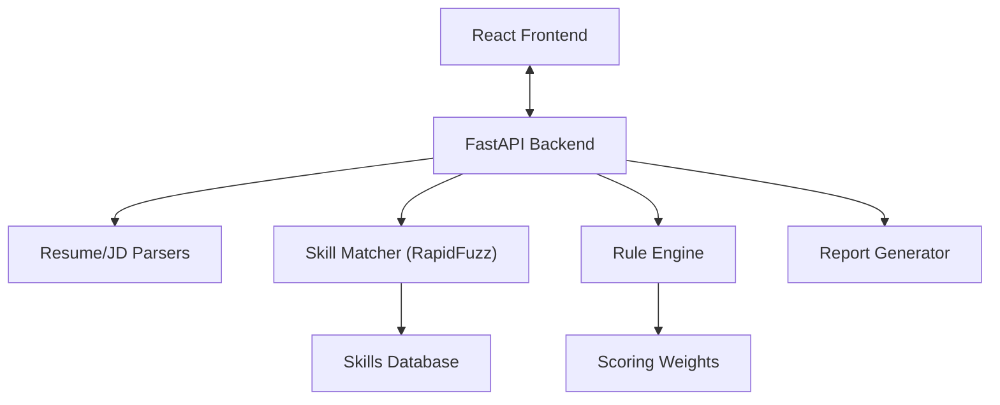

# 🚀 Smart Resume & Job Fit Analyzer

A privacy-focused, AI-assisted tool that helps job seekers tailor their resumes to job descriptions using rule-based scoring and explainable insights. **No LLMs required.**

  

## ✨ Key Features

- **📄 Resume Parsing**: Instantly extracts text and sections from PDF & DOCX files.
- **🔍 Intelligent Matching**:
  - **Fuzzy Matching**: Recognizes typos and variations (e.g., "ReactJS" ≈ "React").
  - **Skill Taxonomy**: Maps 1000+ skills to categories (Languages, Frameworks, Tools).
- **📊 Evidence-Based Scoring**:
  - **0 drift**: Same input always equals same score.
  - **Transparent**: Every point matches a specific signal in your resume.
- **🛡️ Privacy First**:
  - **Local Processing**: Your data never leaves your machine (except for optional PDF export).
  - **Session-Based**: Auto-cleanup of uploaded files.
- **💡 Actionable Insights**:
  - **Gap Analysis**: "You have X, but the job needs Y."
  - **Keyword Optimization**: Suggestions to beat ATS filters ethically.
- **📤 PDF Reports**: Export a comprehensive fit analysis report.

---

## 🏗️ Architecture

A modern full-stack application designed for extendability and performance.



### Directory Structure

```
Smart Resume & Job Fit Analyzer/
├── backend/
│   ├── api/             # REST endpoints (FastAPI)
│   ├── parsers/         # PDF/DOCX text extractors
│   ├── taxonomy/        # Skill normalization logic
│   ├── rules/           # Scoring algorithms & weights
│   ├── exports/         # PDF report generation
│   └── tests/           # Regression & unit tests
└── frontend/
    ├── src/
    │   ├── pages/       # React components/views
    │   ├── services/    # API integration
    │   └── assets/      # Static resources
    └── public/          # Root static files
```

---

## 🚀 Getting Started

Follow these steps to set up the project locally.

### Prerequisites

- **Python**: 3.13 or higher
- **Node.js**: 18.0 or higher
- **npm**: Included with Node.js

### 1. Backend Setup

```bash
cd backend

# Create a virtual environment
python -m venv venv

# Activate Virtual Environment
# Windows:
.\venv\Scripts\activate
# Mac/Linux:
# source venv/bin/activate

# Install dependencies
pip install -r requirements.txt

# Download required NLP models
python -m spacy download en_core_web_sm

# Start the server
uvicorn main:app --reload --port 8000
```

### 2. Frontend Setup

Open a new terminal configuration.

```bash
cd frontend

# Install dependencies
npm install

# Start the development server
npm run dev
```

Visit the app at **http://localhost:5173**.

---

## 🧪 Testing

We use a rigorous testing strategy to ensure reliability.

### Backend Tests
Covers parsing logic, API endpoints, and scoring rules.

```bash
cd backend
pytest tests/ -v
```

### E2E Verification
Simulates a full user flow (Upload -> Analyze -> Export) via script.

```bash
cd backend
python test_e2e_api.py
```

---

## ⚙️ Configuration

You can tweak the scoring logic without changing code by editing `backend/rules/config.yaml`.

```yaml
weights:
  required_skills: 0.40    # Weight of critical skills
  optional_skills: 0.20    # Weight of nice-to-have skills
  experience_depth: 0.25   # Impact of years of experience
  education_match: 0.15    # Impact of degree matching
```

---

## � License

This project is licensed under the MIT License - see the [LICENSE](LICENSE) file for details.

## 🤝 Contributing

Contributions are welcome! Please feel free to submit a Pull Request.
